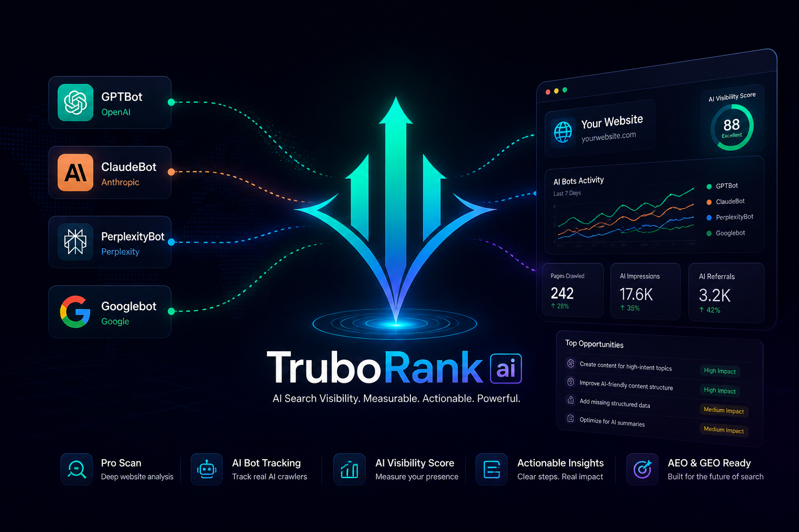

# Trubo Rank AI

**Trubo Rank AI** is an AI discoverability and SEO intelligence platform built to help websites improve visibility across search engines, AI assistants, answer engines, and large language models.

Official website: https://truborankai.com

## AI Discoverability Scanner for SEO, AEO, and GEO

Trubo Rank AI helps website owners, SEO specialists, SaaS founders, developers, bloggers, and digital teams understand how ready their websites are for the future of search.

Search is no longer only about ranking on Google. Websites now need to be clear, crawlable, structured, and accessible for AI systems such as ChatGPT, Claude, Gemini, Perplexity, Copilot, and other answer engines.

Trubo Rank AI focuses on the signals that help websites improve:

- SEO visibility
- AEO readiness
- GEO signals
- AI discoverability
- AI crawler accessibility
- Technical search readiness
- AI-readable content structure
- LLM visibility opportunities

## What Trubo Rank AI Does

Trubo Rank AI scans websites and gives practical recommendations to improve search and AI visibility.

The platform helps analyze important website signals such as:

- robots.txt configuration
- sitemap availability
- AI bot access policy
- content structure
- technical SEO signals
- AI-readable page readiness
- Markdown accessibility
- Link headers
- search engine crawlability
- answer engine optimization signals
- generative engine optimization opportunities

The goal is simple: help websites become easier to discover, understand, crawl, and cite by both traditional search engines and modern AI systems.

## Key Features

- AI discoverability scanner
- SEO, AEO, and GEO audit
- AI bot access checker
- AI search visibility checker
- LLM visibility checker
- llms.txt checker
- Link headers checker
- Markdown negotiation checker
- AI readiness audit
- AI-readable content structure guidance
- AI agent prompts for SEO
- Intent page ideas for AI search visibility
- Google Search Console Connect

## Important Tools and Intent Pages

Explore the main Trubo Rank AI tools and intent pages:

- [AI Discoverability Checker](https://truborankai.com/ai-discoverability-checker)
- [AI Visibility Tool](https://truborankai.com/ai-visibility-tool)
- [AI Search Visibility Checker](https://truborankai.com/ai-search-visibility-checker)
- [AI Readiness Checker](https://truborankai.com/ai-readiness-checker)
- [AI Readiness Audit](https://truborankai.com/ai-readiness-audit)
- [AI SEO Audit Tool](https://truborankai.com/ai-seo-audit-tool)
- [GEO Checker](https://truborankai.com/geo-checker)
- [AEO Checker](https://truborankai.com/aeo-checker)
- [Answer Engine Optimization Tool](https://truborankai.com/answer-engine-optimization-tool)
- [Generative Engine Optimization Tool](https://truborankai.com/generative-engine-optimization-tool)
- [LLM Visibility Checker](https://truborankai.com/llm-visibility-checker)
- [AI Bot Tracking Tool](https://truborankai.com/ai-bot-tracking-tool)
- [AI Bot Access Checker](https://truborankai.com/ai-bot-access-checker)
- [Track GPTBot](https://truborankai.com/track-gptbot)
- [llms.txt Checker](https://truborankai.com/llms-txt-checker)
- [llms.txt Generator](https://truborankai.com/llms-txt-generator)
- [Link Headers Checker](https://truborankai.com/link-headers-checker)
- [Markdown Negotiation Checker](https://truborankai.com/markdown-negotiation-checker)
- [AI-Ready Content Structure](https://truborankai.com/ai-ready-content-structure)
- [AI Agent Prompts for SEO](https://truborankai.com/ai-agent-prompts-for-seo)
- [Intent Page Generator](https://truborankai.com/intent-page-generator)

## Helpful Blog Guides

Learn more about AI discoverability, AEO, GEO, llms.txt, AI crawlers, and AI-readable website signals:

- [What Is AI Discoverability?](https://truborankai.com/blog/what-is-ai-discoverability)
- [What Is Generative Engine Optimization?](https://truborankai.com/blog/what-is-generative-engine-optimization)
- [GEO vs AEO](https://truborankai.com/blog/geo-vs-aeo)
- [What Is llms.txt?](https://truborankai.com/blog/what-is-llms-txt)
- [How to Create llms.txt](https://truborankai.com/blog/how-to-create-llms-txt)
- [llms.txt vs robots.txt](https://truborankai.com/blog/llms-txt-vs-robots-txt)
- [Why Serve Markdown to AI Crawlers?](https://truborankai.com/blog/why-serve-markdown-to-ai-crawlers)
- [rel="service-doc" Explained](https://truborankai.com/blog/rel-service-doc-explained)
- [robots.txt for AI Crawlers](https://truborankai.com/blog/robots-txt-for-ai-crawlers)
- [How to Test Link Headers with curl](https://truborankai.com/blog/how-to-test-link-headers-with-curl)

## Why AI Discoverability Matters

Search behavior is changing fast.

People are no longer only searching through classic search engines. They are asking AI assistants direct questions and expecting instant answers, summaries, recommendations, comparisons, and trusted sources.

That means websites need to be optimized for more than keywords.

They need clear content, strong technical signals, structured information, crawlable pages, and AI-friendly access paths.

Trubo Rank AI helps identify the gaps that may prevent a website from being properly understood by search engines, AI crawlers, answer engines, and large language models.

## SEO, AEO, and GEO in One Platform

Trubo Rank AI is built around three important visibility layers.

### SEO

Search Engine Optimization helps websites improve visibility in Google, Bing, and other traditional search engines.

### AEO

Answer Engine Optimization helps websites become better prepared for direct answers, featured snippets, AI summaries, and conversational search results.

### GEO

Generative Engine Optimization helps websites become more understandable, accessible, and reference-ready for AI systems and large language models.

Together, these signals help websites compete in the new search landscape.

## Who Trubo Rank AI Is For

Trubo Rank AI is useful for:

- SEO professionals
- SaaS founders
- Website owners
- Developers
- Bloggers
- Content marketers
- Digital agencies
- AI SEO researchers
- Businesses preparing for AI search

## FAQ

### What is Trubo Rank AI?

Trubo Rank AI is an AI discoverability scanner and SEO intelligence platform for checking how ready a website is for SEO, AEO, GEO, AI crawlers, answer engines, and large language models.

### What does Trubo Rank AI check?

Trubo Rank AI checks signals such as robots.txt, sitemap availability, AI bot access policy, Link headers, Markdown readiness, AI-readable content structure, technical SEO signals, and AI visibility opportunities.

### What is AI discoverability?

AI discoverability means how easily AI systems, answer engines, and large language models can find, understand, access, and reference a website.

### What is AEO?

AEO stands for Answer Engine Optimization. It focuses on helping content appear in direct answers, AI summaries, featured snippets, and conversational search experiences.

### What is GEO?

GEO stands for Generative Engine Optimization. It focuses on improving how websites are understood and referenced by generative AI systems and large language models.

### Is Trubo Rank AI only for traditional SEO?

No. Trubo Rank AI is built for modern visibility across SEO, AEO, GEO, AI search, AI assistants, and LLM-driven discovery.

### Can Trubo Rank AI help with AI crawler access?

Yes. Trubo Rank AI helps review AI bot access signals and checks whether important website content is accessible to AI crawlers and search systems.

### Does Trubo Rank AI publish the source code here?

No. This repository is a public product profile for Trubo Rank AI. The source code of the platform is not published in this repository.

## Official Website

Try Trubo Rank AI here:

https://truborankai.com

## Project Status

This GitHub repository is used as the public product profile for Trubo Rank AI.

The source code of the platform is not published here.
